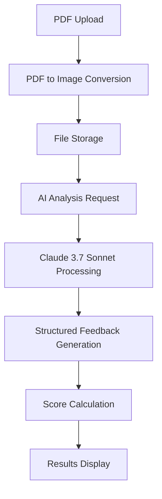

# 🚀 Hireon - AI Resume Analyzer

<div align="center">


**Transform your resume with AI-powered analysis and ATS optimization**

[](https://reactrouter.com/)
[](https://www.typescriptlang.org/)
[](https://tailwindcss.com/)
[](https://vitejs.dev/)

[](https://www.docker.com/)
[](https://puter.com/)

</div>
[Live Demo](https://ai-resumerr.vercel.app)

---

## 📋 Table of Contents

- [✨ Features](#-features)
- [🛠️ Tech Stack](#️-tech-stack)
- [🚀 Quick Start](#-quick-start)
- [📁 Project Structure](#-project-structure)
- [🔧 Configuration](#-configuration)
- [🎨 UI Components](#-ui-components)
- [🤖 AI Integration](#-ai-integration)
- [📱 Responsive Design](#-responsive-design)
- [🐳 Docker Deployment](#-docker-deployment)
- [📊 API Reference](#-api-reference)
- [🤝 Contributing](#-contributing)
- [📄 License](#-license)

---

## ✨ Features

### 🎯 Core Functionality

- **📄 PDF Resume Upload** - Drag & drop PDF resume upload with validation
- **🖼️ PDF to Image Conversion** - Automatic PDF to PNG conversion for preview
- **🤖 AI-Powered Analysis** - Comprehensive resume analysis using Claude 3.7 Sonnet
- **📊 ATS Scoring** - Applicant Tracking System compatibility scoring
- **💡 Smart Feedback** - Detailed improvement suggestions across multiple categories
- **🔐 User Authentication** - Secure login system powered by Puter.js
- **💾 Data Persistence** - Resume data stored in key-value database

### 🎨 User Experience

- **📱 Fully Responsive** - Mobile-first design that works on all devices
- **⚡ Real-time Processing** - Live status updates during analysis
- **🎭 Beautiful UI** - Modern gradient design with smooth animations
- **♿ Accessible** - WCAG compliant with proper alt texts and keyboard navigation
- **🔄 State Management** - Efficient state management with Zustand

### 🔍 Analysis Categories

- **📋 Overall Score** - Comprehensive resume rating (0-100)
- **🤖 ATS Compatibility** - Applicant Tracking System optimization
- **✍️ Tone & Style** - Professional writing and presentation
- **📝 Content Quality** - Relevance and impact of content
- **🏗️ Structure** - Organization and formatting
- **🛠️ Skills Assessment** - Technical and soft skills evaluation

---

## 🛠️ Tech Stack

### Frontend

- **React 19.1.0** - Latest React with concurrent features
- **React Router 7.7.0** - Modern routing with SSR support
- **TypeScript 5.8.3** - Type-safe development
- **Tailwind CSS 4.1.4** - Utility-first styling
- **Vite 6.3.3** - Lightning-fast build tool

### Backend & Services

- **Puter.js** - Cloud platform for authentication, file storage, and AI
- **Claude 3.7 Sonnet** - Advanced AI model for resume analysis
- **PDF.js** - Client-side PDF processing and conversion

### State Management & Utilities

- **Zustand 5.0.6** - Lightweight state management
- **React Dropzone 14.3.8** - File upload with drag & drop
- **clsx & tailwind-merge** - Conditional styling utilities

### Development Tools

- **Docker** - Containerized deployment
- **ESLint & Prettier** - Code quality and formatting
- **TypeScript** - Static type checking

---

## 🚀 Quick Start

### Prerequisites

- **Node.js** 20+
- **npm** or **yarn**
- **Docker** (optional, for containerized deployment)

### Installation

1. **Clone the repository**

   ```bash
   git clone https://github.com/RrezonCurraj/ai-resume-analyzer.git
   cd ai-resume-analyzer
   ```

2. **Install dependencies**

   ```bash
   npm install
   ```

3. **Start development server**

   ```bash
   npm run dev
   ```

4. **Open your browser**
   ```
   http://localhost:5173
   ```

### Available Scripts

```bash
# Development
npm run dev          # Start development server with HMR
npm run build        # Create production build
npm run start        # Start production server
npm run typecheck    # Run TypeScript type checking
```

---

## 📁 Project Structure

```
ai-resume-analyzer/
├── 📁 app/                          # Application source code
│   ├── 📁 components/               # Reusable UI components
│   │   ├── FileUploader.tsx        # Drag & drop file upload
│   │   ├── Navbar.tsx              # Navigation component
│   │   ├── ResumeCard.tsx          # Resume preview card
│   │   └── ScoreTitle.tsx          # Score display component
│   ├── 📁 lib/                      # Utility libraries
│   │   ├── pdf2img.ts              # PDF to image conversion
│   │   ├── puter.ts                # Puter.js integration
│   │   └── utils.ts                # Helper functions
│   ├── 📁 routes/                   # Application routes
│   │   ├── auth.tsx                # Authentication page
│   │   ├── home.tsx                # Dashboard/homepage
│   │   ├── resume.tsx              # Resume review page
│   │   └── Upload.tsx              # Resume upload page
│   ├── app.css                     # Global styles
│   ├── root.tsx                    # Root component
│   └── routes.ts                   # Route configuration
├── 📁 constans/                     # Constants and mock data
│   └── index.ts                    # Resume data and AI prompts
├── 📁 types/                        # TypeScript type definitions
│   ├── index.d.ts                  # Global interfaces
│   └── puter.d.ts                  # Puter.js types
├── 📁 public/                       # Static assets
│   ├── 📁 icons/                   # SVG icons
│   ├── 📁 images/                  # Images and graphics
│   └── pdf.worker.min.mjs          # PDF.js worker
├── 📄 package.json                 # Dependencies and scripts
├── 📄 vite.config.ts               # Vite configuration
├── 📄 tsconfig.json                # TypeScript configuration
├── 📄 Dockerfile                   # Docker configuration
└── 📄 README.md                    # This file
```

---

## 🔧 Configuration

### Environment Setup

The application uses **Puter.js** for backend services. No additional environment variables are required as Puter.js handles:

- User authentication
- File storage and management
- AI model integration
- Key-value database

### Tailwind CSS Configuration

Custom theme configuration in `app.css`:

```css
@theme {
  --font-sans: "Mona Sans", ui-sans-serif, system-ui, sans-serif;
  --color-dark-200: #475467;
  --color-light-blue-100: #c1d3f81a;
  --color-light-blue-200: #a7bff14d;
  /* ... additional custom colors */
}
```

### TypeScript Configuration

Path mapping configured for clean imports:

```json
{
  "paths": {
    "~/*": ["./app/*"]
  }
}
```

---

## 🎨 UI Components

### 🧩 Component Library

| Component      | Description            | Props                                         |
| -------------- | ---------------------- | --------------------------------------------- |
| `FileUploader` | Drag & drop PDF upload | `onFileSelect?: (file: File \| null) => void` |
| `ResumeCard`   | Resume preview card    | `resume: Resume`                              |
| `ScoreCircle`  | Circular score display | `score: number`                               |
| `Navbar`       | Navigation header      | -                                             |

### 🎨 Design System

- **Color Palette**: Custom gradient system with light blue tones
- **Typography**: Mona Sans font family for modern readability
- **Spacing**: Consistent 8px grid system
- **Animations**: Smooth fade-in transitions and hover effects
- **Responsive**: Mobile-first approach with breakpoint-specific layouts

### 🎯 Key UI Features

- **Gradient Borders** - Subtle gradient backgrounds for visual hierarchy
- **Interactive States** - Hover effects and loading states
- **Form Validation** - Real-time input validation and error handling
- **Loading Indicators** - Progress feedback during file processing
- **Error Boundaries** - Graceful error handling with fallback UI

---

## 🤖 AI Integration

### Claude 3.7 Sonnet Integration

The application leverages **Claude 3.7 Sonnet** through Puter.js for:

- **Resume Analysis** - Comprehensive evaluation of resume content
- **ATS Optimization** - Applicant Tracking System compatibility scoring
- **Feedback Generation** - Detailed improvement suggestions
- **Score Calculation** - Multi-category scoring system

### Analysis Pipeline



### Feedback Categories

1. **Overall Score** (0-100) - Comprehensive rating
2. **ATS Compatibility** - System optimization tips
3. **Tone & Style** - Professional presentation
4. **Content Quality** - Relevance and impact
5. **Structure** - Organization and formatting
6. **Skills Assessment** - Technical and soft skills

---

## 📱 Responsive Design

### Breakpoint System

- **Mobile**: `< 640px` - Single column layout
- **Tablet**: `640px - 1024px` - Adaptive grid
- **Desktop**: `> 1024px` - Full feature layout

### Mobile Optimizations

- **Touch-friendly** - Large tap targets and gestures
- **Optimized Images** - Responsive image sizing
- **Simplified Navigation** - Collapsible menu system
- **Performance** - Lazy loading and code splitting

---

## 🐳 Docker Deployment

### Build and Run

```bash
# Build Docker image
docker build -t hireon-ai-resume-analyzer .

# Run container
docker run -p 3000:3000 hireon-ai-resume-analyzer
```

### Multi-stage Build

The Dockerfile uses multi-stage builds for:

- **Development dependencies** - Full dev environment
- **Production dependencies** - Optimized runtime
- **Build process** - Compilation and bundling
- **Final image** - Minimal production container

### Deployment Platforms

Compatible with:

- **AWS ECS** - Elastic Container Service
- **Google Cloud Run** - Serverless containers
- **Azure Container Apps** - Managed containers
- **Digital Ocean App Platform** - Simple deployment
- **Fly.io** - Global edge deployment
- **Railway** - Modern deployment platform

---

## 📊 API Reference

### Puter.js Integration

The application uses Puter.js for backend services:

#### Authentication

```typescript
// Sign in user
await puter.auth.signIn();

// Sign out user
await puter.auth.signOut();

// Check authentication status
const isAuthenticated = await puter.auth.isSignedIn();
```

#### File Management

```typescript
// Upload files
const uploadedFile = await puter.fs.upload([file]);

// Read files
const fileData = await puter.fs.read(filePath);

// Delete files
await puter.fs.delete(filePath);
```

#### AI Services

```typescript
// Get AI feedback
const feedback = await puter.ai.chat(
  [
    {
      role: "user",
      content: [
        { type: "file", puter_path: filePath },
        { type: "text", text: instructions },
      ],
    },
  ],
  { model: "claude-3-7-sonnet" }
);
```

#### Key-Value Storage

```typescript
// Store data
await puter.kv.set("resume:123", JSON.stringify(data));

// Retrieve data
const data = await puter.kv.get("resume:123");

// List keys
const keys = await puter.kv.list("resume:*");
```

---

## 🤝 Contributing

We welcome contributions! Please follow these steps:

1. **Fork the repository**
2. **Create a feature branch** (`git checkout -b feature/amazing-feature`)
3. **Commit your changes** (`git commit -m 'Add amazing feature'`)
4. **Push to the branch** (`git push origin feature/amazing-feature`)
5. **Open a Pull Request**

### Development Guidelines

- Follow TypeScript best practices
- Use Prettier for code formatting
- Write meaningful commit messages
- Add tests for new features
- Update documentation as needed

---

## 📄 License

This project is licensed under the MIT License - see the [LICENSE](LICENSE) file for details.

---

<div align="center">

**Built with ❤️ using React Router and Puter.js**

[](https://github.com/RrezonCurraj/ai-resume-analyzer)
[](https://github.com/RrezonCurraj/ai-resume-analyzer)

</div>
